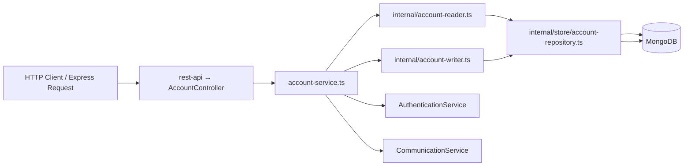

# Backend Architecture

> A **module** is a self-contained package of related functionality in our backend codebase. It encapsulates one domain concept (e.g., accounts, authentication, tasks) and exposes a clear interface for other parts of the system.

This document covers:
1. **Why** we structure code into modules and the benefits of our layout.
2. **What** each folder and file in a module does.
3. A **diagram** that shows how the layers interact at runtime.

---

## 1. Why Modular Architecture?

- **Separation of Concerns**: Clearly divides HTTP routing, business logic, data access, and utilities into distinct layers.
- **Reusability**: Public-facing APIs (`account-service.ts`, `types.ts`) allow other modules to integrate without knowing internal details.
- **Testability**: Small, focused components (reader, writer, util) can be unit-tested in isolation.
- **Consistency**: Applying the same pattern across modules speeds up onboarding and reduces cognitive load.
- **Scalability**: New features or entirely new domains can be added by copying the template and filling in domain specifics.

---

## 2. Concept & Layers Diagram



1. **HTTP Layer** (`rest-api/`): Routing and request/response handling using Express.
2. **Service Layer**: Business logic, orchestration, calls to external services.
3. **Persistence Layer**: Reader/Writer + Repository + DB Schema (MongoDB).
4. **Utilities & Types**: Shared helpers (utils) and data models (DTOs).

---

## 3. Typical Module Folder Structure

```
<module_name>/
├── <module-name>-service.ts   # Public API for other modules
├── internal/                  # Implementation details (not imported externally)
│   ├── store/                 # DB schema & repository
│   │   ├── *-db.ts
│   │   └── *-repository.ts
│   ├── *-reader.ts            # Read operations
│   ├── *-writer.ts            # Write operations
│   └── *-util.ts              # Conversion, validation, common helpers
├── rest-api/                  # HTTP routes & handlers
│   ├── *-server.ts
│   ├── *-router.ts
│   ├── *-controller.ts
│   └── *-serializer.ts
├── types.ts                   # Data Transfer Objects (DTOs)
└── index.ts                   # Public exports
```

> **Note**: Replace `<module_name>` and `*` with your module's actual name.

---

## 4. Module Layout

> We will refer to the **account** module throughout this document to demonstrate each concept.

```
account/
├── account-service.ts
├── internal/
│   ├── store/
│   │   ├── account-db.ts
│   │   └── account-repository.ts
│   ├── account-reader.ts
│   ├── account-writer.ts
│   └── account-util.ts
├── rest-api/
│   ├── account-server.ts
│   ├── account-router.ts
│   ├── account-controller.ts
│   └── account-serializer.ts
├── types.ts
└── index.ts
```

### 4.1 `account-service.ts`

- **Role**
  - Exposes module-wide operations as static methods, e.g. `createAccountByUsernameAndPassword`, `resetAccountPassword`, `getAccountById`, `updateAccountDetails`, plus wiring into **AuthenticationService** (for OTP/password) and **CommunicationService** (for notifications).
- **Imports**
  ```typescript
  import AccountReader from 'backend/modules/account/internal/account-reader';
  import AccountWriter from 'backend/modules/account/internal/account-writer';
  import {
    Account,
    ResetPasswordParams,
    GetAccountParams,
    UpdateAccountDetailsParams,
    ...
  } from 'backend/modules/account';
  import { AuthenticationService } from 'backend/modules/authentication';
  ```
- **Example call**
  ```typescript
  AccountService.createAccountByUsernameAndPassword(
    firstName, lastName, password, username
  )
  ```

---

## 5. Persistence Layer (`internal/store/`)

### 5.1 `account-db.ts`

- Defines the MongoDB schema using Mongoose or similar ODM
- Defines all database fields (e.g. `firstName`, `hashedPassword`, `phoneNumber`, `username`, `active`, `createdAt`, `updatedAt`)
- Exports the schema and model for database operations

### 5.2 `account-repository.ts`

- `class AccountRepository`
- Provides:
  - `collection()` — the MongoDB collection/model
  - Database initialization and index setup
- Central place for low-level DB concerns

---

## 6. I/O Helpers (`internal/`)

### 6.1 `account-reader.ts`

- `class AccountReader` (or default export)
  - High-level **read** methods, e.g.
    - `getAccountById(params: GetAccountParams) -> Account`
    - `getAccountByPhoneNumber(phoneNumber: PhoneNumber) -> Account`
    - `getAccountByUsernameAndPassword(password: string, username: string) -> Account`
  - Uses `AccountRepository` to fetch data
  - Converts raw DB data → domain objects
  - Raises module-specific exceptions if not found or duplicates

### 6.2 `account-writer.ts`

- `class AccountWriter` (or default export)
  - High-level **write** methods, e.g.
    - `createAccountByUsernameAndPassword(...) -> Account`
    - `createAccountByPhoneNumber(phoneNumber: PhoneNumber) -> Account`
    - `updateAccountDetails(accountId: string, params: UpdateAccountDetailsParams) -> Account`
    - `resetAccountPassword(params: ResetPasswordParams) -> Account`
  - Handles:
    - Phone-number validation
    - Password hashing via `AccountUtil.hashPassword()`
    - Database insert/update operations
    - Not-found errors

### 6.3 `account-util.ts`

- `class AccountUtil` (or collection of utility functions)
  - `hashPassword(password: string) -> string`
  - `comparePassword(password: string, hashedPassword: string) -> boolean`
  - Data conversion and validation helpers

---

## 7. Shared Types & Errors

### 7.1 `types.ts`

All of the data transfer objects (DTOs) are TypeScript interfaces or types, for instance:
```typescript
export interface Account {
  id: string;
  firstName: string;
  lastName: string;
  username: string;
  phoneNumber: PhoneNumber;
  hashedPassword: string;
}

export interface ResetPasswordParams {
  accountId: string;
  newPassword: string;
}
```
Clients import these for type safety.

### 7.2 Error Handling

Custom error classes extending `AppError`, e.g.:
```typescript
class AccountWithUserNameExistsError extends AppError { ... }
class AccountWithPhoneNumberNotFoundError extends AppError { ... }
class AccountNotFoundError extends AppError { ... }
```
Each carries its own HTTP status code and error code.

---

## 8. HTTP Layer (`rest-api/`)

### 8.1 `account-server.ts`

Bootstraps an Express `Router`:
```typescript
export function create(): Router {
  const router = Router();
  return AccountRouter.create(router);
}
```

### 8.2 `account-router.ts`

Registers URL rules on the Router:
```typescript
router.post('/accounts', AccountController.createAccount);
router.get('/accounts/:id', AccountController.getAccountById);
router.patch('/accounts/:id', AccountController.updateAccount);
```

### 8.3 `account-controller.ts`

Controller class with request handlers:
- Uses `express.Request` and `express.Response` to parse JSON
- Marshals params into typed objects
- Calls `AccountService.*`
- Returns JSON responses with appropriate status codes
- Handles validation errors and business logic exceptions

### 8.4 `account-serializer.ts`

- Transforms internal domain objects into API response format
- Handles serialization/deserialization of complex types
- Ensures consistent API response structure
