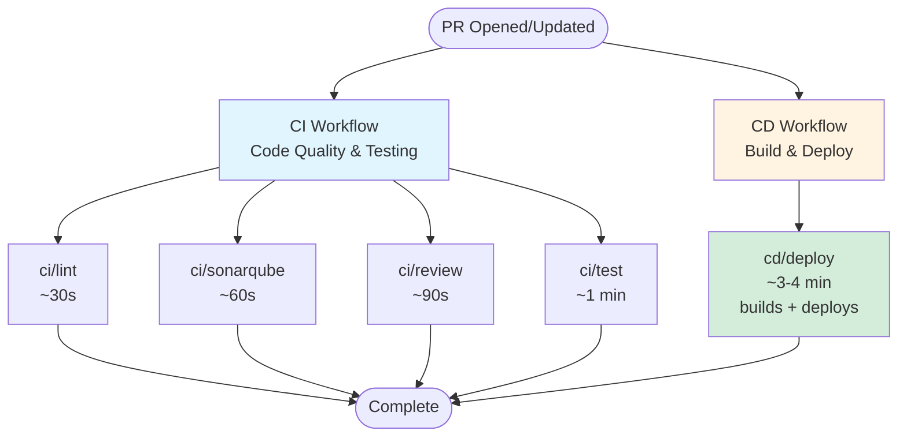

# CI/CD Pipeline

This project uses **GitHub Actions** for continuous integration and deployment on **Kubernetes**, using workflows defined in [github-ci](https://github.com/jalantechnologies/github-ci).

---

## CI/CD Pipeline Structure

When you open or update a pull request, CI and CD workflows run independently:

### CI Workflow (Code Quality & Testing)
All jobs run in parallel and independently:

1. **ci/lint** (~30s) - ESLint and Markdown checks for code style and potential errors
2. **ci/sonarqube** (~60s) - Code quality metrics, complexity, and code smells
3. **ci/review** (~90s) - Automated code review (placeholder for future AI-powered review)
4. **ci/test** (~1 min) - Integration tests with MongoDB using docker-compose

### CD Workflow (Build & Deploy)
Single job that builds Docker image and deploys:

1. **cd/deploy** (~3-4 min) - Builds Docker image and deploys to `{pr-name}.preview.platform.bettrhq.com`

**Note:** All CI checks are advisory and run independently. CD deploys regardless of CI status to enable fast iteration. Code merged to `main` should have passing CI checks from the PR.

---

## Deployment Environments

### Per PR (Preview) Deployment

Each pull request triggers a temporary, isolated environment with:

- A unique URL generated for every pull request (e.g., `https://<github_sha>.preview.platform.bettrhq.com`)
- Automatic deployment on every push to the PR
- Automatic cleanup when the PR is closed

This ensures every PR can be tested independently before merging.

### Permanent Preview

- Always reflects the latest `main` branch
- Useful for ongoing testing of the integrated codebase
- URL: [https://preview.node-react-template.platform.bettrhq.com](https://preview.node-react-template.platform.bettrhq.com)

### Production

- The live app for end users
- Deploys automatically on merge to the `main` branch
- URL: [https://node-react-template.platform.bettrhq.com](https://node-react-template.platform.bettrhq.com)

---

## Deployment Workflows

### CD Workflows
- **cd** - Deploys preview environment for each PR (`cd/deploy`)
- **cd_production** - Deploys to production when code is merged to `main` (`cd_production/deploy`)
- **cd_permanent_preview** - Updates permanent preview when `main` changes (`cd_permanent_preview/deploy`)

### Cleanup Workflows
- **cleanup_pr** - Automatically removes preview environment when PR is closed

All credentials and secrets are securely managed via GitHub secrets and environment variables. Deployments use github-ci actions for Docker image building and Kubernetes deployment.
