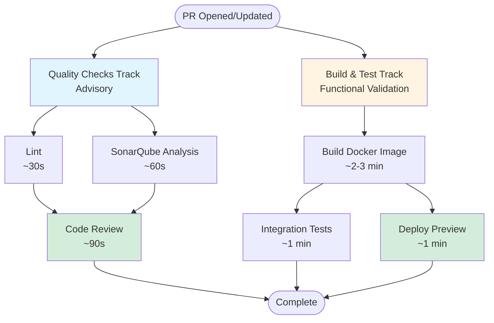

# CI/CD Pipeline

This project uses **GitHub Actions** for continuous integration and deployment on **Kubernetes**, using workflows defined in [github-ci](https://github.com/jalantechnologies/github-ci).

---

## CI Pipeline

When you open or update a pull request, two independent tracks run in parallel:

### Quality Checks Track (Advisory)
Provides code quality feedback without blocking deployments:

1. **Lint** (~30s) - ESLint and Markdown checks for code style and potential errors
2. **SonarQube Analysis** (~60s) - Code quality metrics, complexity, and code smells
3. **Code Review** (~90s) - Automated code review (runs only after lint and SonarQube pass)

### Build & Test Track
Validates functionality and deploys preview environments:

1. **Build Docker Image** (~2-3 min) - Creates containerized application
2. **Integration Tests & Deploy Preview** (parallel after build):
   - **Integration Tests** (~1 min) - Runs `compose:test` with MongoDB
   - **Deploy Preview** (~1 min) - Deploys to `{pr-name}.preview.platform.bettrhq.com`

**Note:** Code merged to `main` must go through pull requests with passing quality checks. Production and permanent preview deployments skip redundant checks since they've already been validated at the PR level.

---

## Deployment Environments

### Per PR (Preview) Deployment

Each pull request triggers a temporary, isolated environment with:

- A unique URL generated for every pull request (e.g., `https://<github_sha>.preview.platform.bettrhq.com`)
- Automatic deployment on every push to the PR
- Automatic cleanup when the PR is closed

This ensures every PR can be tested independently before merging.

### Permanent Preview

- Always reflects the latest `main` branch
- Useful for ongoing testing of the integrated codebase
- URL: [https://preview.node-react-template.platform.bettrhq.com](https://preview.node-react-template.platform.bettrhq.com)

### Production

- The live app for end users
- Deploys automatically on merge to the `main` branch
- URL: [https://node-react-template.platform.bettrhq.com](https://node-react-template.platform.bettrhq.com)

---

## CD Pipeline (Deployment Workflows)

Deployments are handled via **GitHub Actions** and [github-ci](https://github.com/jalantechnologies/github-ci).

### Deployment Workflows

- **Preview Environment (PR)** - Automatic preview deployment for each PR
- **Production Deployment** - Deploys to production when code is merged to `main`
- **Permanent Preview Deployment** - Updates permanent preview when `main` changes

### Cleanup Workflows

- **Cleanup on PR Close** - Automatically removes preview environment when PR is closed
- **Cleanup on Branch Delete** - Automatically removes preview environment when branch is deleted
- **Manual Cleanup** - Allows manual cleanup of preview environments via workflow dispatch

All credentials and secrets are securely managed via GitHub secrets and environment variables
