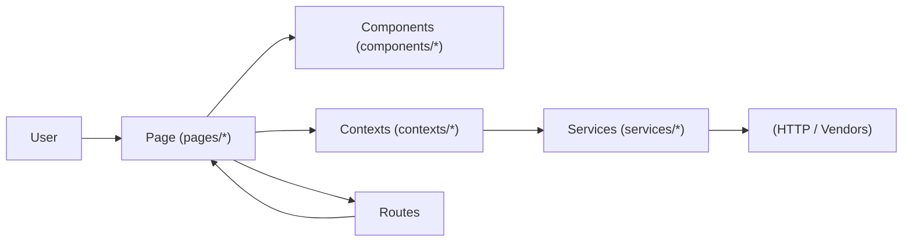
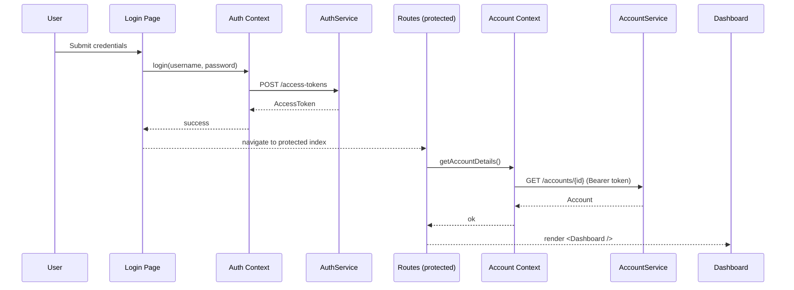

# Frontend Architecture

> A **feature** is the smallest unit of UX value (e.g., Login, Dashboard, Reset Password). Each feature composes **pages** from reusable **components**, orchestrates data via **contexts**, and calls **services** that encapsulate HTTP. **Routes** bind features to URLs. **constants** and **types** are the shared contracts.

This document covers:
1. **Why** the frontend is structured into layers and how they collaborate
2. **What** each layer is responsible for, with **examples from this repo**
3. **How** requests flow end-to-end (page → context → service → backend → UI)

---

## 1) Why this architecture?

The frontend is designed with clear boundaries so developers always know where to put code and where to look for it later. By separating responsibilities into layers, we reduce coupling between UI, state, and data access. This makes it easier to evolve features independently, onboard new engineers, and keep technical debt under control.

- **Separation of concerns**: UI rendering (components/pages), state (contexts), data access (services), and navigation (routes) are cleanly separated.
- **Replaceable boundaries**: APIs/vendors can change with minimal UI rewrites.
- **Predictability & scale**: Every new feature follows the same recipe: **page + route + service + context + components**.
- **Testability**: Pages are thin, services are pure wrappers around HTTP, contexts have tiny, mockable APIs.

---

## 2) High-level runtime flow

This diagram shows how data and control flow through the app at runtime. Users interact with **pages**, which compose **components** for UI and rely on **contexts** for shared state. Contexts in turn call **services** that encapsulate API logic, while **routes** decide which page to render.



---

## 3) Repository layout

The folder structure reflects the architecture. Each directory maps to one of the layers in the flow above. This ensures that when you work on a feature, you know exactly where to place new code — and when debugging, where to look.

```
frontend/
  components/       # UI building blocks (button, header, inputs, layouts, flex, etc.)
  pages/            # Screens (login, dashboard, reset-password, otp, about, etc.)
  contexts/         # Global providers (auth, account, reset-password, async)
  services/         # API clients (auth, account, api, app, reset-password)
  routes/           # Router setup + public/protected route logic
  constants/        # Shared constants (routes, messages, endpoints)
  types/            # DTOs & helpers (account, auth, service-response, etc.)
  utils/, helpers/  # Logger, storage-util, config
  vendor/           # Third-party shims (inspectlet)
  index.tsx, app.component.tsx
```

---

## 4) Routing

Routing is the entry point for the user experience. It decides whether to show public flows like login/signup or protected flows like the dashboard. Keeping routing logic isolated makes authentication, redirection, and navigation consistent across the app.

- **`routes/index.tsx`**:
  Uses `isUserAuthenticated()` from `auth.provider.tsx`.
  Builds router with `createBrowserRouter(publicRoutes | protectedRoutes)`.

- **`routes/public.tsx`**:
  Login, signup, forgot-password, reset-password, otp, about.

- **`routes/protected.tsx`**:
  App shell + `getAccountDetails()`.
  On error → toast → `logout()` → navigate to `/login`.

---

## 5) Services

Services are the bridge between our frontend and backend. They encapsulate all network calls so that no UI code depends on HTTP details. This makes our API layer replaceable, testable, and consistent.

- **`services/app.service.ts`** → runtime host + axios setup
- **`services/api.service.ts`** → standard `this.apiClient` with baseURL `/api`
- **`services/auth.service.ts`**
  - `login(username, password)` → `POST /access-tokens`
  - `signup(...)`, `refreshToken()`, OTP flows
- **`services/account.service.ts`**
  - `getAccountDetails(token)` → `GET /accounts/{id}`
- **`services/reset-password.service.ts`**
  - multi-step reset flow for forgot/reset pages

---

## 6) Contexts

Contexts provide global state and shared APIs for the app. By centralizing authentication, account info, and reset-password flows, they prevent prop drilling and ensure all parts of the app behave consistently.

- **`auth.provider.tsx`**
  `useAuthContext()` → `{ isUserAuthenticated, login(), logout(), signup(), sendOTP(), verifyOTP() }`
  Stores tokens via `utils/storage-util.ts`.

- **`account.provider.tsx`**
  `useAccountContext()` → `{ accountDetails, isLoading, error, getAccountDetails() }`
  Auto-fetched on protected routes.

- **`reset-password.provider.tsx`**
  State for forgot-password/reset-password flows.

---

## 7) Pages

Pages are orchestration layers. They decide which components to render, when to call services, and how to handle success or failure. This keeps them close to the user experience while avoiding business logic.

- **`pages/login/index.tsx`**
  - Uses `useAuthContext().login()`.
  - Delegates form logic to `login-form.hook.ts` (Formik + Yup).
  - On success: navigate to dashboard.
  - On error: show toast.

- **`pages/dashboard/index.tsx`**
  - Rendered via protected routes.
  - Assumes `accountDetails` is available from context.

- **`pages/authentication/*`**
  - Forgot-password, OTP, reset-password flows.
  - Each uses a hook + component split for form logic.

---

## 8) Components

Components are the building blocks of our UI. They are designed to be reusable, stateless, and presentation-focused, so they can be shared across multiple pages and features.

- **Primitives**: `button/`, `input/`, `form-control/`, `flex/`
- **Layouts**: `layouts/` (`custom-layout`, `horizontal-stack-layout`)
- **Chrome**: `header/`, `sidebar/`
- **Feedback**: `toast/`, `dialog/`, `loader/`
- **Typography**: `typography/h2.tsx`, `paragraph-medium.tsx`

---

## 9) Shared contracts

Shared contracts act as the **canonical interface** between layers. They establish the standardized types, constants, and endpoints that every part of the application depends on. By centralizing these definitions, we ensure consistency, reduce duplication, and prevent divergence across features.

This structure makes the system **predictable** (all routes are sourced from `constants/routes.ts`), **type-safe** (shared DTOs define the exact shape of API inputs and outputs), and **maintainable** (updating a type or endpoint in one place propagates across the codebase).

- **`constants/routes.ts`** → canonical paths for navigation and redirects
- **`constants/countries.ts`** → shared dropdown data
- **`types/service-response.ts`** → standardized API wrapper
- **`types/auth.ts`**, **`types/account.ts`**, **`types/common-types.ts`** → domain models and DTOs

---

## 10) Example end-to-end flow (Login → Dashboard)

This flow illustrates how the different layers collaborate. The page orchestrates the user action, context handles state, service executes the API call, and routing ensures only valid sessions reach protected screens.


